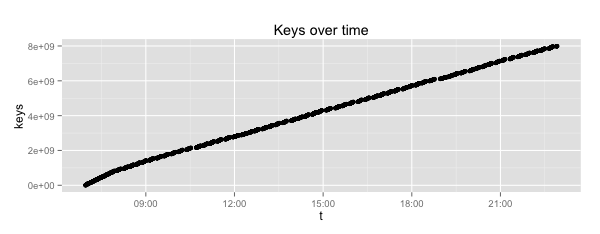
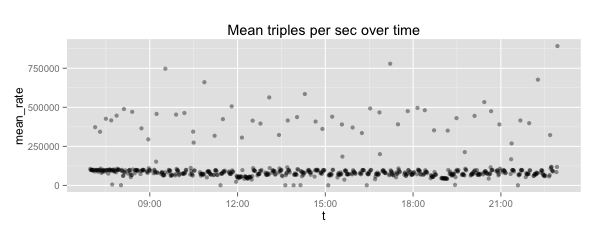
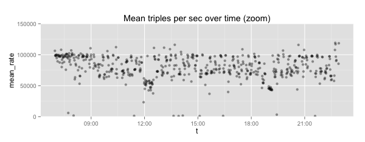
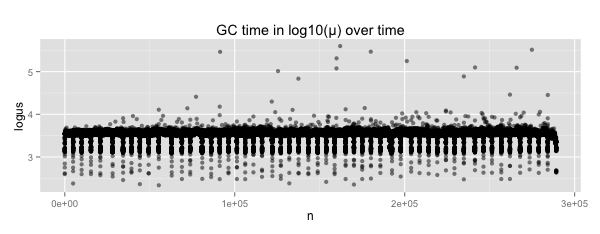
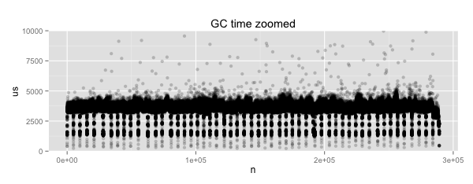

# A tiny graph database

The code is tiny, but the data can be single-machine big.

Currently requires [`rocksdb`](http://rocksdb.org/), but many other
back ends (e.g., [`levigo`](https://github.com/jmhodges/levigo) or
[`goleveldb`](https://github.com/syndtr/goleveldb)) would be easy to
support.

Also see [Cayley](https://github.com/google/cayley).  I have a
[fork](http://github.csv.comcast.com/jsteph206/cayley) that supports
[`rocksdb`](http://rocksdb.org/).  I wrote Tinygraph primarily because
I wanted to avoid Cayley's string interning (and reference counting)
and I didn't want to rewrite by rocksdb support for Cayley to store
strings directly.  (The latter probably would be easy.)

## Status

Highly experimental.

ToDo:

1. Hook up Javascript REPL.
2. Decent logging.
3. Test cases.
4. Docs.
5. Do another version of rocksdb support for Cayley that stores strings directly (as this code does).
6. Port `options.go` back to Cayley's `rocksdb/options.go`.
7. Publish my fork of `github.com/DanielMorsing/rocksdb`.
8. Document Wordnet load/use.


## WordNet

It's easy to load [WordNet RDF](http://wordnet-rdf.princeton.edu/).


## Freebase

Currently I'm using this code to load all of
[Freebase](https://developers.google.com/freebase/data).

### Machine
```
RAM        64GB
cores      24 (with HT)
model name Six-Core AMD Opteron(tm) Processor 8435
cpu MHz    2593.770
cache size 512 KB
disks      7xHDD (?)
```

### Tinygraph/rocksdb config

```Javascript
{
  "allow_mmap_reads": false,
  "allow_mmap_writes": false,
  "allow_os_buffer": true,
  "background_threads": 12,
  "batch_size": 12000,
  "block_size": 65536,
  "bytes_per_sync_power": 25,
  "cache_size": 3.3554432e+07,
  "compression": "snappy",
  "disable_data_sync": true,
  "disable_wal": true,
  "high_priority_background_threads": 12,
  "increase_parallelism": 12,
  "initial_compaction": false,
  "level0_num_file_compaction_trigger": 24,
  "log_level": 10,
  "max_background_compactions": 8,
  "max_background_flushes": 8,
  "max_open_files": 512,
  "max_write_buffer_number": 4,
  "min_write_buffer_number_to_merge": 4,
  "num_levels": 6,
  "paranoid_checks": false,
  "stats_dump_period": 300,
  "stats_loop": true,
  "sync": false,
  "target_file_size_base_power": 29,
  "target_file_size_multiplier": 4,
  "triples_file": "/dev/shm/rocks/in/1,/dev/shm/rocks/in/2,/dev/shm/rocks/in/3,/dev/shm/rocks/in/4,/dev/shm/rocks/in/5",
  "wal_dir": "/dev/shm/rocks",
  "write_buffer_size_power": 28
 }
```

### Processing

```
lines     2 638 544 493
bytes   356 018 834 809
start   2014-07-20T22:55:13.279Z
done    2014-07-20T06:57:23.543Z
elapsed 15:58:50
keys    Should be 8B, but still verifying
disk    89 943 764 K
```

### Rocksdb levels

```
Level Files Size(MB)
--------------------
  L0     6      478 
  L1     0        0 
  L2     2     1026 
  L3     7     1524 
  L4     4     7399 
  L5     3    77283 
 Sum    22    87710 
```

### Graphs













### Notes

I sometimes [listened](images/load/mp3) to spot rates while doing other things.  Funny.
