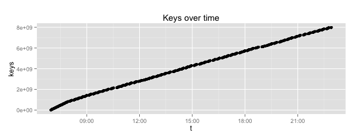
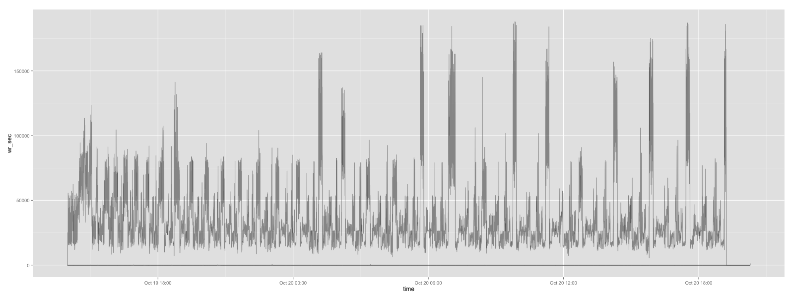
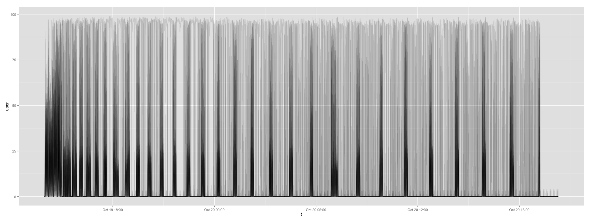

# Misc notes

## WordNet

### Example WordNet queries from the REPL

```Javascript
g = G.Open("config.wordnet");
label = G.Bs("http://www.w3.org/2000/01/rdf-schema#label");
hypo = G.Bs("http://wordnet-rdf.princeton.edu/ontology#hyponym");
paths = G.In(label).Out(hypo).Out(label).Walk(g, G.Vertex("virus")).Collect();
for (var i=0; i<paths.length; i++) { console.log(paths[i][2].Strings()[2]); }

holo = G.Bs("http://wordnet-rdf.princeton.edu/ontology#part_holonym");
paths = G.In(label).Out(holo).Out(label).Walk(g, G.Vertex("Africa")).Collect();
for (var i=0; i<paths.length; i++) { console.log(paths[i][2].Strings()[2]); }
```

gives

```
arbovirus
arbovirus
phage
phage
plant virus
animal virus
slow virus
tumor virus
vector
```

and

```
Barbary
Nubia
Mahgrib
Mahgrib
African nation
African nation
East Africa
South West Africa
South West Africa
South West Africa
Republic of Angola
Republic of Angola
Republic of Burundi
Republic of Burundi
Republic of Cameroon
Republic of Cameroon
Republic of Cameroon
...
```

### Using the Tinygraph HTTP interface

Start `tinygraph` with `-serve`.  Then:

```Shell
cat <<EOF > holo.js
function holonyms(term) {
  var label = G.Bs("http://www.w3.org/2000/01/rdf-schema#label");
  var holo = G.Bs("http://wordnet-rdf.princeton.edu/ontology#part_holonym");
  var paths = G.In(label).Out(holo).Out(label).Walk(G.Graph(), G.Vertex(term)).Collect();
  var uniq = {};
  var acc = [];
  for (var i=0; i<paths.length; i++) {
	  var h = paths[i][2].Strings()[2];
	  console.log(h);
	  if (!uniq[h]) {
          uniq[h] = true;
		  acc.push(h);
	  }
  }
  return acc;
}
holonyms("Africa");
EOF
curl --data-urlencode 'js@holo.js' http://localhost:8080/js
```

```Javascript
[
    "Barbary",
    "Nubia",
    "Mahgrib",
    "African nation",
    "East Africa",
    "South West Africa",
    "Republic of Angola",
    "Republic of Burundi",
    "Republic of Cameroon",
    "Central African Republic",
    "Tchad",
    "Republic of the Congo",
    "Zaire",
	...
]
```

The previous work has given us a stored procedure.

```
curl --data-urlencode 'js=holonyms("Africa")' http://localhost:8080/js
```

### Example: Recursive hypernyms

```Shell
cat <<EOF > hyper.js
var label = G.Bs("http://www.w3.org/2000/01/rdf-schema#label");

function find(term) {
  var paths = G.In(label).Walk(G.Graph(), G.Vertex(term)).Collect();
  var acc = [];
  for (var i=0; i<paths.length; i++) {
	  var id = paths[i][0].Strings()[2];
      acc.push(id);
  }
  return acc;
}

function labels(id) {
  var paths = G.Out(label).Walk(G.Graph(), G.Vertex(id)).Collect();
  var acc = [];
  for (var i=0; i<paths.length; i++) {
	  var name = paths[i][0].Strings()[2];
	  console.log("label", name);
      acc.push(name);
  }
  return acc;
}

function collect(rel, id, acc, uniq, recursive, reverse, maxDepth, depth) {
  var paths;
  if (reverse) {
     paths = G.In(rel).Walk(G.Graph(), G.Vertex(id)).Collect();
  } else {
     paths = G.Out(rel).Walk(G.Graph(), G.Vertex(id)).Collect();
  }
  for (var i=0; i<paths.length; i++) {
	  var h = paths[i][0].Strings()[2];
      console.log(id, "collected", h);
	  if (!uniq[h]) {
          uniq[h] = true;
		  acc.push({labels: labels(h), depth: depth});
		  if (recursive && depth <= maxDepth) {
			  collect(rel, h, acc, uniq, recursive, reverse, maxDepth, depth+1);
		  }
	  }
  }
}

function recurse(rel, reverse, maxDepth, term) {
  var acc = [];
  var uniq = {};
  var ids = find(term);
  for (var i=0; i<ids.length; i++) {
      collect(G.Bs(rel), ids[i], acc, uniq, true, reverse, maxDepth, 0);
  }
  return acc;
}

function hypernyms(term) {
  return recurse("http://wordnet-rdf.princeton.edu/ontology#hypernym", false, 1000, term);
}

hypernyms("virus");
EOF
curl --data-urlencode 'js@hyper.js' http://localhost:8080/js
```

Now that stuff should be available:

```Shell
curl --data-urlencode 'js=hypernyms("radish")' http://localhost:8080/js
```

If you have [`jq`](http://stedolan.github.io/jq/):

```Shell
curl --data-urlencode 'js=hypernyms("radish")' http://localhost:8080/js | ./jq -c '.[]'
```

gives

```Javascript
["root vegetable"]
["veg","vegetable","veggie"]
["garden truck","green goods","green groceries","produce"]
["food","solid food"]
["solid"]
["matter"]
["physical entity"]
["entity"]
["cruciferous vegetable"]
["crucifer","cruciferous plant"]
["herb","herbaceous plant"]
["tracheophyte","vascular plant"]
["flora","plant","plant life"]
["being","organism"]
["animate thing","living thing"]
["unit","whole"]
["object","physical object"]
["radish","radish plant"]
["root"]
["plant organ"]
["plant part","plant structure"]
["natural object"]
```

Cheap geography:

```Shell
curl --data-urlencode 'js=recurse("http://wordnet-rdf.princeton.edu/ontology#part_meronym", false, 1000, "Tripoli")' \
  http://localhost:8080/js | ./jq -c '.[]'
```

```
collect http://wordnet-rdf.princeton.edu/wn31/108977154-n depth 1 labels Lebanese Republic,Lebanon
collect http://wordnet-rdf.princeton.edu/wn31/108809019-n depth 2 labels Middle East,Mideast,Near East
collect http://wordnet-rdf.princeton.edu/wn31/109230176-n depth 2 labels Asia
collect http://wordnet-rdf.princeton.edu/wn31/109297922-n depth 3 labels Eurasia
collect http://wordnet-rdf.princeton.edu/wn31/108579780-n depth 4 labels eastern hemisphere,orient
collect http://wordnet-rdf.princeton.edu/wn31/108629219-n depth 4 labels northern hemisphere
collect http://wordnet-rdf.princeton.edu/wn31/108979872-n depth 0 labels Tarabulus Al-Gharb,Tripoli,capital of Libya
collect http://wordnet-rdf.princeton.edu/wn31/108979456-n depth 1 labels Libya,Socialist People's Libyan Arab Jamahiriya
collect http://wordnet-rdf.princeton.edu/wn31/109212308-n depth 2 labels Africa
```


### WordNet relations

```Shell
gzip -dc wn31.nt.gz | cut -d ' ' -f 2 | sort | uniq
<http://lemon-model.net/lemon#canonicalForm>
<http://lemon-model.net/lemon#decomposition>
<http://lemon-model.net/lemon#otherForm>
<http://lemon-model.net/lemon#reference>
<http://lemon-model.net/lemon#sense>
<http://lemon-model.net/lemon#writtenRep>
<http://wordnet-rdf.princeton.edu/ontology#action>
<http://wordnet-rdf.princeton.edu/ontology#adjposition>
<http://wordnet-rdf.princeton.edu/ontology#agent>
<http://wordnet-rdf.princeton.edu/ontology#also>
<http://wordnet-rdf.princeton.edu/ontology#antonym>
<http://wordnet-rdf.princeton.edu/ontology#attribute>
<http://wordnet-rdf.princeton.edu/ontology#beneficiary>
<http://wordnet-rdf.princeton.edu/ontology#cause>
<http://wordnet-rdf.princeton.edu/ontology#creator>
<http://wordnet-rdf.princeton.edu/ontology#derivation>
<http://wordnet-rdf.princeton.edu/ontology#domain_category>
<http://wordnet-rdf.princeton.edu/ontology#domain_member_category>
<http://wordnet-rdf.princeton.edu/ontology#domain_member_region>
<http://wordnet-rdf.princeton.edu/ontology#domain_member_usage>
<http://wordnet-rdf.princeton.edu/ontology#domain_region>
<http://wordnet-rdf.princeton.edu/ontology#domain_usage>
<http://wordnet-rdf.princeton.edu/ontology#entail>
<http://wordnet-rdf.princeton.edu/ontology#experiencer>
<http://wordnet-rdf.princeton.edu/ontology#gloss>
<http://wordnet-rdf.princeton.edu/ontology#goal>
<http://wordnet-rdf.princeton.edu/ontology#hypernym>
<http://wordnet-rdf.princeton.edu/ontology#hyponym>
<http://wordnet-rdf.princeton.edu/ontology#instance_hypernym>
<http://wordnet-rdf.princeton.edu/ontology#instance_hyponym>
<http://wordnet-rdf.princeton.edu/ontology#instrument>
<http://wordnet-rdf.princeton.edu/ontology#lexical_domain>
<http://wordnet-rdf.princeton.edu/ontology#lex_id>
<http://wordnet-rdf.princeton.edu/ontology#location>
<http://wordnet-rdf.princeton.edu/ontology#member_holonym>
<http://wordnet-rdf.princeton.edu/ontology#member_meronym>
<http://wordnet-rdf.princeton.edu/ontology#old_sense_key>
<http://wordnet-rdf.princeton.edu/ontology#part_holonym>
<http://wordnet-rdf.princeton.edu/ontology#participle>
<http://wordnet-rdf.princeton.edu/ontology#part_meronym>
<http://wordnet-rdf.princeton.edu/ontology#part_of_speech>
<http://wordnet-rdf.princeton.edu/ontology#patient>
<http://wordnet-rdf.princeton.edu/ontology#pertainym>
<http://wordnet-rdf.princeton.edu/ontology#phrase_type>
<http://wordnet-rdf.princeton.edu/ontology#product>
<http://wordnet-rdf.princeton.edu/ontology#result>
<http://wordnet-rdf.princeton.edu/ontology#sample>
<http://wordnet-rdf.princeton.edu/ontology#sense_number>
<http://wordnet-rdf.princeton.edu/ontology#sense_tag>
<http://wordnet-rdf.princeton.edu/ontology#similar>
<http://wordnet-rdf.princeton.edu/ontology#substance_holonym>
<http://wordnet-rdf.princeton.edu/ontology#substance_meronym>
<http://wordnet-rdf.princeton.edu/ontology#synset_member>
<http://wordnet-rdf.princeton.edu/ontology#tag_count>
<http://wordnet-rdf.princeton.edu/ontology#theme>
<http://wordnet-rdf.princeton.edu/ontology#translation>
<http://wordnet-rdf.princeton.edu/ontology#verb_frame_sentence>
<http://wordnet-rdf.princeton.edu/ontology#verb_group>
<http://wordnet-rdf.princeton.edu/ontology#verbnet_class>
<http://www.w3.org/1999/02/22-rdf-syntax-ns#first>
<http://www.w3.org/1999/02/22-rdf-syntax-ns#rest>
<http://www.w3.org/1999/02/22-rdf-syntax-ns#type>
<http://www.w3.org/2000/01/rdf-schema#label>
<http://www.w3.org/2002/07/owl#sameAs>
```


## Freebase

Currently I'm using this code to load all of
[Freebase](https://developers.google.com/freebase/data).

Summary: I processed 2,638,544,493 lines (356,018,834,809 bytes) into
2,386,769,886 unique triples (edges) in 16 hours.  On disk, the
database is 90GB.  So we can run all of Freebase out of RAM (via the
page cache).

But: Still verifying that processing.

See below for some example queries.


### Machine
```
RAM        64GB
cores      24 (with HT)
model name Six-Core AMD Opteron(tm) Processor 8435
cpu MHz    2593.770
cache size 512 KB
disks      7xHDD
```

## Configuration

See `config.freebase`.


### Rocksdb levels

```
Level Files Size(MB)
--------------------
  L0     6      478 
  L1     0        0 
  L2     2     1026 
  L3     7     1524 
  L4     4     7399 
  L5     3    77283 
 Sum    22    87710 
```

### Graphs





Disk writes/sec:



CPU `%user`:




### Example low-level query

```Go
g.Do(SPO, &Triple{[]byte("http://rdf.freebase.com/ns/m.0h55n27"), nil, nil, nil}, nil, ... )
```

```
next [http://rdf.freebase.com/ns/m.0h55n27 http://rdf.freebase.com/key/wikipedia.en America_ebolavirus ]
next [http://rdf.freebase.com/ns/m.0h55n27 http://rdf.freebase.com/key/wikipedia.en EBOV-R ]
next [http://rdf.freebase.com/ns/m.0h55n27 http://rdf.freebase.com/key/wikipedia.en Ebola_Reston ]
next [http://rdf.freebase.com/ns/m.0h55n27 http://rdf.freebase.com/key/wikipedia.en REBOV ]
next [http://rdf.freebase.com/ns/m.0h55n27 http://rdf.freebase.com/key/wikipedia.en RESTV ]
next [http://rdf.freebase.com/ns/m.0h55n27 http://rdf.freebase.com/key/wikipedia.en Reston_Ebola_virus ]
next [http://rdf.freebase.com/ns/m.0h55n27 http://rdf.freebase.com/key/wikipedia.en Reston_ebolavirus ]
next [http://rdf.freebase.com/ns/m.0h55n27 http://rdf.freebase.com/key/wikipedia.en Reston_virus ]
next [http://rdf.freebase.com/ns/m.0h55n27 http://rdf.freebase.com/key/wikipedia.en Virginia_ebolavirus ]
next [http://rdf.freebase.com/ns/m.0h55n27 http://rdf.freebase.com/key/wikipedia.en_id 33041857 ]
next [http://rdf.freebase.com/ns/m.0h55n27 http://rdf.freebase.com/key/wikipedia.en_title Reston_virus ]
next [http://rdf.freebase.com/ns/m.0h55n27 http://rdf.freebase.com/ns/common.topic.article http://rdf.freebase.com/ns/m.0h55n2c ]
next [http://rdf.freebase.com/ns/m.0h55n27 http://rdf.freebase.com/ns/common.topic.description Reston virus was first described in 1990 as a new "strain" of Ebola virus, a result of mutation from Ebola virus. It is the single member o\
f the species Reston ebolavirus, which is included into the genus Ebolavirus, family Filoviridae, order Mononegavirales. Reston virus is named after Reston, Virginia, US, where the virus was first discovered.
RESTV was discovered in crab-eating macaques from Hazleton Laboratories in 1989. This attracted significant media attention due to the proximity of Reston to the Washington, DC metro area, and the lethality of a closely related Ebola \
virus. Despite its status as a level-4 organism, Reston virus is non-pathogenic to humans, though hazardous to monkeys; the perception of its lethality was confounded due to the monkey's coinfection with Simian hemorrhagic fever virus\
. ]
next [http://rdf.freebase.com/ns/m.0h55n27 http://rdf.freebase.com/ns/common.topic.image http://rdf.freebase.com/ns/m.059jkjn ]
next [http://rdf.freebase.com/ns/m.0h55n27 http://rdf.freebase.com/ns/common.topic.notable_for http://rdf.freebase.com/ns/g.1256ncwfc ]
next [http://rdf.freebase.com/ns/m.0h55n27 http://rdf.freebase.com/ns/common.topic.notable_types http://rdf.freebase.com/ns/m.03sp3gw ]
next [http://rdf.freebase.com/ns/m.0h55n27 http://rdf.freebase.com/ns/common.topic.topic_equivalent_webpage http://en.wikipedia.org/wiki/Reston_virus ]
next [http://rdf.freebase.com/ns/m.0h55n27 http://rdf.freebase.com/ns/common.topic.topic_equivalent_webpage http://en.wikipedia.org/wiki/index.html?curid=33041857 ]
next [http://rdf.freebase.com/ns/m.0h55n27 http://rdf.freebase.com/ns/type.object.key /wikipedia/en/America_ebolavirus ]
next [http://rdf.freebase.com/ns/m.0h55n27 http://rdf.freebase.com/ns/type.object.key /wikipedia/en/EBOV-R ]
next [http://rdf.freebase.com/ns/m.0h55n27 http://rdf.freebase.com/ns/type.object.key /wikipedia/en/Ebola_Reston ]
next [http://rdf.freebase.com/ns/m.0h55n27 http://rdf.freebase.com/ns/type.object.key /wikipedia/en/REBOV ]
next [http://rdf.freebase.com/ns/m.0h55n27 http://rdf.freebase.com/ns/type.object.key /wikipedia/en/RESTV ]
next [http://rdf.freebase.com/ns/m.0h55n27 http://rdf.freebase.com/ns/type.object.key /wikipedia/en/Reston_Ebola_virus ]
next [http://rdf.freebase.com/ns/m.0h55n27 http://rdf.freebase.com/ns/type.object.key /wikipedia/en/Reston_ebolavirus ]
next [http://rdf.freebase.com/ns/m.0h55n27 http://rdf.freebase.com/ns/type.object.key /wikipedia/en/Reston_virus ]
next [http://rdf.freebase.com/ns/m.0h55n27 http://rdf.freebase.com/ns/type.object.key /wikipedia/en/Virginia_ebolavirus ]
next [http://rdf.freebase.com/ns/m.0h55n27 http://rdf.freebase.com/ns/type.object.key /wikipedia/en_id/33041857 ]
next [http://rdf.freebase.com/ns/m.0h55n27 http://rdf.freebase.com/ns/type.object.key /wikipedia/en_title/Reston_virus ]
next [http://rdf.freebase.com/ns/m.0h55n27 http://rdf.freebase.com/ns/type.object.name Reston virus ]
next [http://rdf.freebase.com/ns/m.0h55n27 http://rdf.freebase.com/ns/type.object.type http://rdf.freebase.com/ns/common.topic ]
next [http://rdf.freebase.com/ns/m.0h55n27 http://rdf.freebase.com/ns/type.object.type http://rdf.freebase.com/ns/medicine.disease_cause ]
next [http://rdf.freebase.com/ns/m.0h55n27 http://www.w3.org/1999/02/22-rdf-syntax-ns#type http://rdf.freebase.com/ns/common.topic ]
next [http://rdf.freebase.com/ns/m.0h55n27 http://www.w3.org/1999/02/22-rdf-syntax-ns#type http://rdf.freebase.com/ns/medicine.disease_cause ]
next [http://rdf.freebase.com/ns/m.0h55n27 http://www.w3.org/2000/01/rdf-schema#label Reston virus ]
```


### Using the HTTP interface

```Shell
echo '{"db_dir":"freebase.en","read_only":true}' > freebase-read.js
./tinygraph -repl
```

```Shell
cat <<EOF > req.js
G.Scan(G.Graph(), G.Bs("http://rdf.freebase.com/ns/m.0h55n27"), 100);
EOF
curl --data-urlencode 'js@req.js' http://localhost:9081/js
```

```Javascript
[
    [
      "http://rdf.freebase.com/ns/m.0h55n27",
      "http://rdf.freebase.com/key/wikipedia.en",
      "America_ebolavirus",
      ""
    ],
    [
      "http://rdf.freebase.com/ns/m.0h55n27",
      "http://rdf.freebase.com/key/wikipedia.en",
      "EBOV-R",
      ""
    ],
    [
      "http://rdf.freebase.com/ns/m.0h55n27",
      "http://rdf.freebase.com/key/wikipedia.en",
      "Ebola_Reston",
      ""
    ],
    [
      "http://rdf.freebase.com/ns/m.0h55n27",
      "http://rdf.freebase.com/key/wikipedia.en",
      "REBOV",
      ""
    ],
    [
      "http://rdf.freebase.com/ns/m.0h55n27",
      "http://rdf.freebase.com/key/wikipedia.en",
      "RESTV",
      ""
    ], ...
]
```


```Javascript
function desc(mid) { return G.Out(G.Bs("http://rdf.freebase.com/ns/common.topic.description")).Walk(G.Graph(), G.Vertex(mid)).Collect()[0][0].Strings()[2]; }
ebola = "http://rdf.freebase.com/ns/m.0h55n27";
desc(ebola);
```

> Reston virus was first described in 1990 as a new "strain" of Ebola
> virus, a result of mutation from Ebola virus. It is the single
> member of the species Reston ebolavirus, which is included into the
> genus Ebolavirus, family Filoviridae, order Mononegavirales. Reston
> virus is named after Reston, Virginia, US, where the virus was first
> discovered.  RESTV was discovered in crab-eating macaques from
> Hazleton Laboratories in 1989. This attracted significant media
> attention due to the proximity of Reston to the Washington, DC metro
> area, and the lethality of a closely related Ebola virus. Despite
> its status as a level-4 organism, Reston virus is non-pathogenic to
> humans, though hazardous to monkeys; the perception of its lethality
> was confounded due to the monkey's coinfection with Simian
> hemorrhagic fever virus.

Try to use the HTTP API to check to see what strings are aliases for topics.

```Shell
cat <<EOF > topic.js
var candidates = ["Ebola", "fruitcake", "no such topic", "Triton"];
var alias = G.Bs("http://rdf.freebase.com/ns/common.topic.alias");
function countTopics(name) {
   return G.In(alias).Walk(G.Graph(), G.Vertex(name)).Collect().length;
}
var result = {};
for (var i = 0; i < candidates.length; i++) {
	var candidate = candidates[i];
    result[candidate] = countTopics(candidate);
}
result;
EOF
curl --data-urlencode 'js@topic.js' http://localhost:8080/js
```

Here's an example of looking up ids and getting their descriptions.

```Shell
cat <<EOF > desc.js
var candidates = ["Ebola", "fruitcake", "no such topic", "Triton"];

var desc = G.Bs("http://rdf.freebase.com/ns/common.topic.description");
function description(mid) {
    console.log('description("' + mid + '")');
	var ss = G.Out(desc).Walk(G.Graph(), G.Vertex(mid)).Collect();
	var acc = [ ];
	for (var i = 0; i < ss.length; i++) {
        acc.push(ss[0][0].Strings()[2]);
	}
	return acc;
}

var alias = G.Bs("http://rdf.freebase.com/ns/common.topic.alias");
function findTopics(name) {
   var result = {}
   result.ids = {}
   var ss = G.In(alias).Walk(G.Graph(), G.Vertex(name)).Collect();
   for (var i = 0; i < ss.length; i++) {
	  var id = ss[i][0].Strings()[2];
	  console.log('findTopics("' + name + '"): id ' + id);
      result.ids[id] = description(id);
   }
   return result;
}

var result = {};
for (var i = 0; i < candidates.length; i++) {
	var candidate = candidates[i];
    result[candidate] = findTopics(candidate);
}
result;
EOF
curl --data-urlencode 'js@desc.js' http://localhost:8080/js
```

An attempt to find anything in Freebase associated with some term:

```Shell
cat <<EOF > find.js
var desc = G.Bs("http://rdf.freebase.com/ns/common.topic.description");
function description(mid) {
    console.log('description("' + mid + '")');
	var ss = G.Out(desc).Walk(G.Graph(), G.Vertex(mid)).Collect();
	var acc = [ ];
	for (var i = 0; i < ss.length; i++) {
        acc.push(ss[0][0].Strings()[2]);
	}
	return acc;
}

function findTopics(name) {
   var result = {}
   result.ids = {}
   var ss = G.AllIn().Walk(G.Graph(), G.Vertex(name)).Collect();
   for (var i = 0; i < ss.length; i++) {
	  var id = ss[i][0].Strings()[2];
	  var rel = ss[i][0].Strings()[1];
      var o = {rel: rel, id: id, description: description(id)};
      result.ids[id] = o;
   }
   return result;
}
EOF
curl --data-urlencode 'js@find.js' http://localhost:8080/js
```


Find some knowledge re Ghana

```Shell
cat <<EOF > ghana.js
var desc = G.Bs("http://rdf.freebase.com/ns/common.topic.description");
function description(mid) {
    console.log('description("' + mid + '")');
	var ss = G.Out(desc).Walk(G.Graph(), G.Vertex(mid)).Collect();
	var acc = [ ];
	for (var i = 0; i < ss.length; i++) {
        acc.push(ss[0][0].Strings()[2]);
	}
	return acc;
}

var id = "http://rdf.freebase.com/ns/m.035dk";
var rel = G.Bs("http://rdf.freebase.com/ns/location.location.people_born_here");
var ss = G.Out(rel).Walk(G.Graph(), G.Vertex(id)).Collect();
var acc = [];
var limit = 20
for (var i = 0; i < ss.length && i < limit; i++) {
    var p = ss[i][0].Strings()[2];
    acc.push(description(p))
}
acc;
EOF
curl --data-urlencode 'js@ghana.js' http://localhost:8080/js
```

A few triples from Ghana:

```Shell
cat <<EOF > ghana.js
var id = "http://rdf.freebase.com/ns/m.035dk";
var ss = G.AllOut().Walk(G.Graph(), G.Vertex(id)).CollectSome(1000);
var acc = [];
var limit = 1100;
for (var i = 0; i < ss.length && i < limit; i++) {
    var t = ss[i][0].Strings();
    acc.push(t)
}
acc;
EOF
curl --data-urlencode 'js@ghana.js' http://localhost:8080/js
```

Here's a variation using Javascript-accessible iterators:

```Shell
cat <<EOF > iter.js
var id = "http://rdf.freebase.com/ns/m.035dk";
var rel = G.Bs("http://rdf.freebase.com/ns/type.object.name")
var i = G.AllOut().Out(rel).Walk(G.Graph(), G.Vertex(id)).Iter(10);
var acc = []
for (var x = i.Next(); !i.IsClosed(); x = i.Next()) {
    var tuple = [x[0].Strings()[1], x[1].Strings()[2]];
    acc.push(tuple);
}
acc;
EOF
curl --data-urlencode 'js@iter.js' http://localhost:8080/js
```

```Javascript
[
    [
      "http://rdf.freebase.com/ns/base.aareas.schema.administrative_area.administrative_area_type",
      "Sovereign state"
    ],
    [
      "http://rdf.freebase.com/ns/base.aareas.schema.administrative_area.administrative_children",
      "Western Region, Ghana"
    ],
    [
      "http://rdf.freebase.com/ns/base.aareas.schema.administrative_area.administrative_children",
      "Brong-Ahafo Region"
    ],
    [
      "http://rdf.freebase.com/ns/base.aareas.schema.administrative_area.administrative_children",
      "Upper West Region"
    ],
    [
      "http://rdf.freebase.com/ns/base.aareas.schema.administrative_area.administrative_children",
      "Ashanti Region"
    ],
    [
      "http://rdf.freebase.com/ns/base.aareas.schema.administrative_area.administrative_children",
      "Upper East Region"
    ],
    [
      "http://rdf.freebase.com/ns/base.aareas.schema.administrative_area.administrative_children",
      "Central Region, Ghana"
    ],
    [
      "http://rdf.freebase.com/ns/base.aareas.schema.administrative_area.administrative_children",
      "Eastern Region, Ghana"
    ],
    [
      "http://rdf.freebase.com/ns/base.aareas.schema.administrative_area.administrative_children",
      "Greater Accra Region"
    ],
    [
      "http://rdf.freebase.com/ns/base.aareas.schema.administrative_area.administrative_children",
      "Northern Region, Ghana"
    ]
]
```

How many triples starting at Ghana?

```Shell
cat <<EOF > countout.js
function countout(id) {
  return G.AllOut().Walk(G.Graph(), G.Vertex(id)).Collect().length;
}
countout("http://rdf.freebase.com/ns/m.035dk");
EOF
curl --data-urlencode 'js@countout.js' http://localhost:8080/js
```

Answer: 3,288.

How about for [the Clash](https://www.freebase.com/m/07h76)?

```Shell
curl --data-urlencode 'js=countout("http://rdf.freebase.com/ns/m.07h76")' http://localhost:8080/js
```

Answer: 1,255.

Now for the "in" direction:

```Shell
cat <<EOF > countin.js
function countin(id) {
  return G.AllIn().Walk(G.Graph(), G.Vertex(id)).Collect().length;
}
EOF
curl --data-urlencode 'js@countin.js' http://localhost:8080/js
curl --data-urlencode 'js=countin("http://rdf.freebase.com/ns/m.035dk")' http://localhost:8080/js
curl --data-urlencode 'js=countin("http://rdf.freebase.com/ns/m.07h76")' http://localhost:8080/js
```

2,246 for Ghana and 814 for the Clash.

In this example, we look up the Wikipedia topic
[Ghana](http://en.wikipedia.org/wiki/Ghana)
[in Freebase](https://www.freebase.com/m/035dk), and we sample some
properties of that topic.

```Shell
cat <<EOF > wfacts.js
function wikipediaFreebaseFacts(wikiTitle,limit,sample) {
   if (!sample) {
      sample = 1.0;
   }
   if (!limit) {
      limit = 128;
   }
   var titleRel = G.Bs("http://rdf.freebase.com/key/wikipedia.en_title");
   var nameRel = G.Bs("http://rdf.freebase.com/ns/type.object.name")
   var i = G.In(titleRel).AllOut().Out(nameRel).Walk(G.Graph(), G.Vertex(wikiTitle)).Iter(limit);
   var acc = [];
   for (var x = i.Next(); !i.IsClosed(); x = i.Next()) {
       if (Math.random() <= sample) {
          var tuple = [x[1].Strings()[1], x[2].Strings()[2]];
          acc.push(tuple);
       }
   }
   return acc;
}
wikipediaFreebaseFacts("Ghana", 100, 0.2);
EOF
curl --data-urlencode 'js@wfacts.js' http://localhost:8080/js > foo
```

```Javascript
[
    [
      "http://rdf.freebase.com/ns/base.aareas.schema.administrative_area.administrative_area_type",
      "Sovereign state"
    ],
    [
      "http://rdf.freebase.com/ns/base.aareas.schema.administrative_area.administrative_children",
      "Central Region, Ghana"
    ],
    [
      "http://rdf.freebase.com/ns/base.aareas.schema.administrative_area.administrative_children",
      "Volta Region"
    ],
    [
      "http://rdf.freebase.com/ns/base.aareas.schema.administrative_area.administrative_parent",
      "Earth"
    ],
    [
      "http://rdf.freebase.com/ns/base.aareas.schema.administrative_area.pertinent_type",
      "Ghanaian metropolitan district"
    ],
    [
      "http://rdf.freebase.com/ns/film.film_location.featured_in_films",
      "Motherland"
    ],
    [
      "http://rdf.freebase.com/ns/government.governmental_jurisdiction.agencies",
      "Refugee Board"
    ],
    [
      "http://rdf.freebase.com/ns/government.governmental_jurisdiction.government_positions",
      "Vice President of Ghana"
    ],
    [
      "http://rdf.freebase.com/ns/location.country.administrative_divisions",
      "Ashanti Region"
    ],
    [
      "http://rdf.freebase.com/ns/location.country.administrative_divisions",
      "Greater Accra Region"
    ],
    [
      "http://rdf.freebase.com/ns/location.country.internet_tld",
      "gh"
    ],
    [
      "http://rdf.freebase.com/ns/location.country.languages_spoken",
      "Asante dialect"
    ],
    [
      "http://rdf.freebase.com/ns/location.country.languages_spoken",
      "Dagaare language"
    ],
    [
      "http://rdf.freebase.com/ns/location.country.languages_spoken",
      "Gonja Language"
    ],
    [
      "http://rdf.freebase.com/ns/location.location.containedby",
      "Africa"
    ],
    [
      "http://rdf.freebase.com/ns/location.location.contains",
      "Fort Prinzenstein"
    ]
  ]
```


